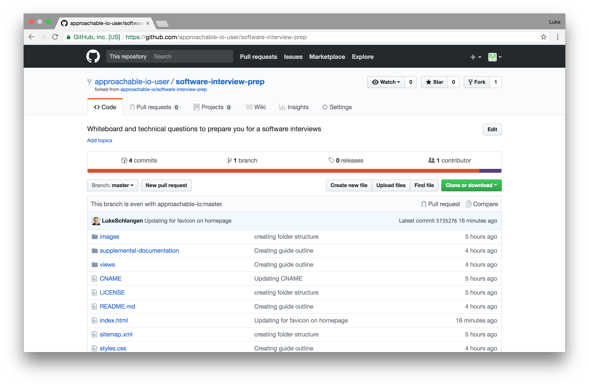
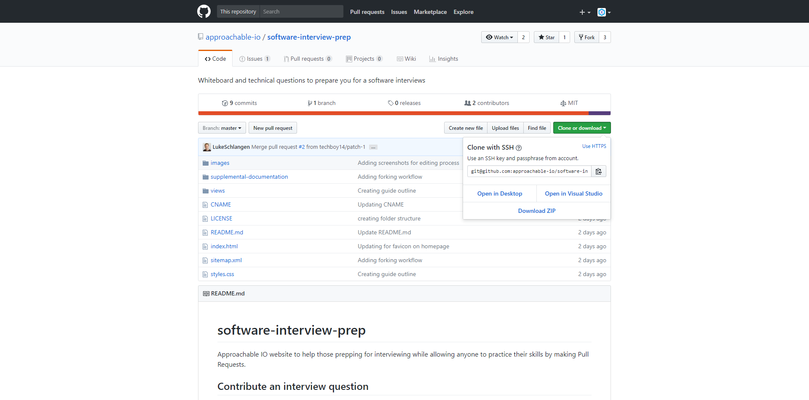

# software-interview-prep
Approachable IO website to help those prepping for interviewing while allowing anyone to practice their skills by making Pull Requests.

## Contribute an interview question
If you're a Git/Github expert, feel free to skip some sections. If you have never made a Pull Request before, check out our [getting-started](https://github.com/approachable-io/getting-started) guide which will show you how to create your Github account and make your first Open Source contribution. The following guide assumes you have already taken those steps. If you have that down, let's jump into sharing your interview question!

### Install Git
Here is a detailed explanation of [how to install git](https://git-scm.com/book/en/v2/Getting-Started-Installing-Git)

### Fork the project
A fork is a copy of a project. In this case, you will be copying the project [software-interview-prep](https://github.com/approachable-io/software-interview-prep), making a change to that copy, and then making a Pull Request - a request for the original product to incorporate your changes.

Click the `Fork` button in the top right corner of the screen to fork the repository.


If everything goes smoothly it should look like this for a few seconds


And then it should look like this 

The difference between the repository you started with and this new repository is that your username should appear in the top left. If your username is `grace-hopper`, it should say something like `grace-hopper / software-interview-prep` and the line below it should read `forked from approachable-io / software-interview-prep`.

### Clone the fork

Once you've forked the repo, you need to be able to edit it on your local machine.

To do this, click on the green clone or download button, and click the clipboard to copy the repo URL.



In this picture, you can see that the clone is using SSH format (git@github.com:\<user\>/\<repo\>.git). You may also 
use 
the HTTPS format if you prefer (https://github.com/\<user\>/\<repo\>).

Once you have that copied, open your command line (cmd.exe on Windows, Terminal on macOS, and if you use linux you'll
 know where it is), `cd` to the directory you want to clone the repo into. For me it will be `~` (`/home/redxtech/`).

Once you're in your desired directory, run this command:
```bash
$ git clone git@github.com:redxtech/software-interview-prep.git
```
That will be cloned into a directory called `software-interview-prep`. If I wanted to make it a different directory, I would run this 
command:
```bash
$ git clone git@github.com:redxtech/software-interview-prep.git ~/cloned-folder
```

Once it finishes, you can `cd` into the directory with `$ cd software-interview-prep`.

### Install dependencies

Typically, most software projects will have dependencies that need to be installed before you can begin to work on 
the project. This will most likely be mentioned in the README of the project, but if not, you will have to explore 
and find out yourself. Most node/js projects will use npm as the package manager, so you can just run `$ npm install`
 (or `$ yarn`) and it will install everything for you (provided you have node & npm or yarn installed on your 
 computer already). Most python projects will have a requirements.txt file with all of the packages needed. You can 
 install these with `$ pip install -r requirements.txt`. Some projects don't have any dependencies at all This differs
 based on what languages the projects use, and who writes them, so reading the README is the best way to find out.

Once you have all the dependencies installed, it's time to add your contribution.

### Creating a branch

Most projects utilize git's branch feature, as they should. It's a powerful tool. I wont go into depth explaining it,
 but you can find many resources online. In a few words, they are ways to let multiple people work on separate things
 at the same time.

To create a branch for your contribution, run this command:

```bash
$ git checkout -b <branch name>
```

This runs creates a new branch in the repo, and checks it out (opens it). If there are already multiple branches, and
 you want to make a branched based off of another branch, use:
 
 ```bash
 $ git checkout -b <branch name> master
 ```

Where master is the name of the branch you want to base your new branch off of. To switch to another branch that has 
already been created, run:

```bash
$ git checkout <branch name>
```

### Making your changes

Now that we have our own branch, we can begin to contribute. First, we need to make some changes. What I'm doing 
right now, is editing the `README.md` file, so I would run:

```bash
$ vim README.md
```

Any other editor or IDE will work just fine (I personally use WebStorm), I just chose vim because it's powerful and 
available on most computers. Once we've made all the changes necessary, we need to stage them:

```bash
$ git add README.md
```

You can stage all files by using `.` instead of a filename. This is useful when you have more than one file that has 
changed. You can check the status of your changes with:

```bash
$ git status
```

And see what changes you've made since your latest commit with:

```bash
$ git diff
```

### Committing changes

Once you've staged your changes, you're ready to commit them. Committing is marking a change in your project, and you
 can reset to that commit easily. To commit your staged changes, run:

```bash
$ git commit -m "made changes"
```

The `-m` and `"made changes"` mean commit with message `"made changes"`. Every commit needs a message, as it 
describes what the commit did. Try to make these messages useful, as not doing so can make it harder if you need to 
backtrack, and if anyone else wants to see what you've done.

If you're lazy, and want to save as many keystrokes as possible, you can run:

```bash
$ git commit -ma "made changes"
```

The `a` means stage all changes. This removes the need to `$ git add .`, as it does this already.

## Want to contribute in another way?
Anyone can help make this project better - check out [issues](https://github.com/approachable-io/approachable-io/issues)!
