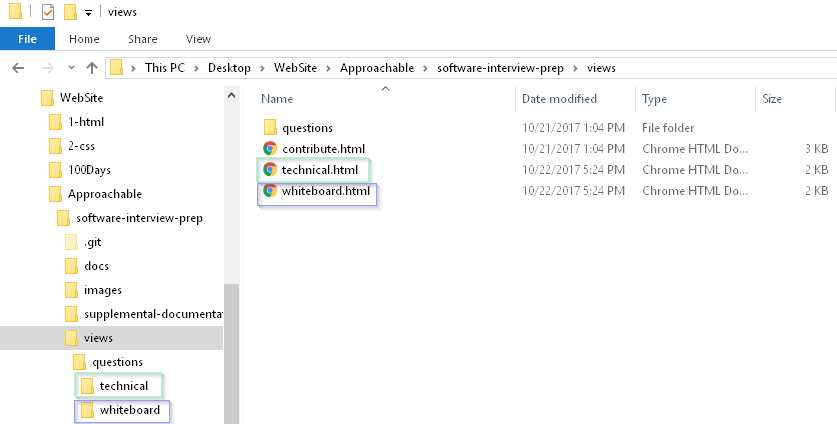
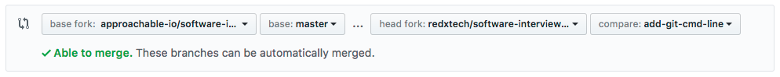

# software-interview-prep
Approachable IO is a website created to help those prepping for interviewing for positions in Software Engineering. It is also a great resource for anyone looking to practice their skills by making Pull Requests.

## Table of Contents
<!-- START doctoc generated TOC please keep comment here to allow auto update -->
<!-- DON'T EDIT THIS SECTION, INSTEAD RE-RUN doctoc TO UPDATE -->


- [Contribute an interview question](#contribute-an-interview-question)
  - [Install Git](#install-git)
  - [Fork the project](#fork-the-project)
  - [Clone the fork](#clone-the-fork)
  - [Install dependencies](#install-dependencies)
  - [Creating a branch](#creating-a-branch)
  - [Making your changes](#making-your-changes)
  - [Committing changes](#committing-changes)
  - [Pushing commits](#pushing-commits)
  - [Stash and Pop](#stash-and-pop)
  - [Making a Pull Request (PR)](#making-a-pull-request-pr)
- [Want to contribute in another way?](#want-to-contribute-in-another-way)

<!-- END doctoc generated TOC please keep comment here to allow auto update -->

## Contribute an interview question
If you're a Git/Github expert, feel free to skip some sections. If you have never made a Pull Request before, check out our [getting-started](https://github.com/approachable-io/getting-started) guide, which will show you how to create your Github account and make your first Open Source contribution. The following guide assumes you have already taken those steps. If you're ready, let's jump into contributing an interview question!

[Back to Top](#table-of-contents)

### Install Git
Here is a detailed explanation of [how to install git](https://git-scm.com/book/en/v2/Getting-Started-Installing-Git).

[Back to Top](#table-of-contents)

### Fork the project
A fork is a copy of a project. In this case, you will be copying the project [software-interview-prep](https://github.com/approachable-io/software-interview-prep), making a change to that copy, and then making a Pull Request. A Pull Request is a request for the original project to include your changes.

Click the `Fork` button in the top right corner of the screen to fork the repository.


If everything goes smoothly it should look like this for a few seconds:


And then it should look like this: 

The difference between the original repository and the new repository you created is that your username should appear in the top left. If your username is `grace-hopper`, it should say something like `grace-hopper / software-interview-prep` and the line below it should read `forked from approachable-io / software-interview-prep`.

[Back to Top](#table-of-contents)

### Clone the fork

Once you've forked the repo, you need to be able to edit it on your local machine.

To do this, click on the green clone or download button, and click the clipboard to copy the repo URL.


In this picture, you can see that the clone is using HTTPS format (`https://github.com/<user>/<repo>.git`). You may also use the SSH format if you prefer (`git@github.com:<user>/<repo>`).

Once you have that copied, open your command line (_cmd.exe_ on Windows, _Terminal_ on macOS, and if you use linux you'll know where it is), `cd` to the directory you want to clone the repo into.

Once you're in your desired directory, run this command (_remember to replace the `<your-username>` with your github username_):

```bash
git clone https://github.com/<your-username>/software-interview-prep.git
```
That will be cloned into a directory called `software-interview-prep`. If I wanted to make it a different directory, such as `~/cloned-folder`, I would run this
command:
```bash
git clone https://github.com/<your-username>/software-interview-prep.git ~/cloned-folder
```

Once it finishes, you can `cd` into the directory with `cd software-interview-prep`.


[Back to Top](#table-of-contents)

### Install dependencies

At this point, many projects will require you to install dependencies. Put simply, this is external software which is needed for the product to function correctly.

Currently, this repo only has dependency named [doctoc](https://github.com/thlorenz/doctoc) which is only required for adding `Tables of Content`. But if you would like to learn more, [click here.](supplemental-documentation/dependencies.md)

[Back to Top](#table-of-contents)

### Creating a branch

Most projects utilize git's branch feature, as they should. It's a powerful tool. I won't go into depth explaining it,
 but you can find many resources online. In a few words, they are ways to let multiple people work on separate things
 at the same time.

To create a branch for your contribution, run this command:

```bash
git checkout -b <branch name>
```

This creates a new branch in the repo, and checks it out (opens it). If there are already multiple branches, and
 you want to make a branched based off of another branch, use:

 ```bash
 git checkout -b <branch name> master
 ```

Where master is the name of the branch you want to base your new branch off of. To switch to another branch that has
already been created, run:

```bash
git checkout <branch name>
```


[Back to Top](#table-of-contents)

### Making your changes

Now that we have our own branch, we can make our changes. There are two ways to edit files, either in GitHub, or with a text editor on your computer. Open the file containing the code in a code editor. You can use any code editing program you are comfortable with, popular choices are _Atom_, _VS Code_, and _Sublime Text_.

People spend a lot of time choosing their favorite text editor, but don't get stuck here, _Atom_ and _VS Code_ are both great options, so we recommend simply picking one quickly.  For detailed help, see [Using Atom](supplemental-documentation/using-atom.md) or [Using VS Code](supplemental-documentation/using-vs-code) for more information about using a text editor to create new files and add them to the main lists of interview questions. 



For the purpose of this project we will be adding an `html` file in one of the question directories located in `views\questions` with the name of your question as the file name:

- If your question is a general technical question it would be placed in `questions\technical`.
- If your question is asking for a code example it would be added to `questions\whiteboard`.

Remember to type the name in lowercase with `-` separating words instead of spaces (i.e.: for the _Fizz Buzz_ question, the file name must be _fizz-buzz.html_).

If you made a copy of an existing question to get the basic formatting to be consistent, please make sure to update your `h1` and `title` to match your question (i.e.: for the _Fizz Buzz_ question, the _\<title\>_ and the _\<h1\>_ in the html file must be `<title>Fizz Buzz | Software Interview Whiteboard Questions </title>` and `<h1>Fizz Buzz</h1>`, respectively).

After adding your question file in the appropriate question directory you will want to add a link to the respective question list page in the views directory. You will be editing either `views\technical.html` or `views\whiteboard.html`.

Once we've made all the changes necessary, we need to stage them:

```bash
git add .
```

You can stage specific files by using `git add <file>` instead of `.`. This is useful when you have more than one file that has
changed, but only specific files you want to commit. You can also pass a directory, for example `git add images`, to stage the entire
directory that I put the images in. You can check the status of your changes with:

```bash
git status
```

And see what changes you've made since your latest commit with:

```bash
git diff
```

To exit this screen press `q`.


[Back to Top](#table-of-contents)

### Committing changes

Once you've staged your changes, you're ready to commit them. Committing is marking a change in your project, and you
 can reset to that commit easily. To commit your staged changes, run:

```bash
git commit -m "made changes"
```

The `-m` and `"made changes"` mean commit with message `"made changes"`. Every commit needs a message, as it
describes what the commit did. Try to make these messages useful, as not doing so can make it harder if you need to
backtrack, and if anyone else wants to see what you've done.

If you're lazy, and want to save as many keystrokes as possible, you can run:

```bash
git commit -ma "made changes"
```

The `a` means stage all changes. This removes the need to `git add .`, as it does this already.


[Back to Top](#table-of-contents)

### Pushing commits

Once you've made your changes and committed them, you'll want to share your changes to the original repo (the one you
 forked). The changes you've made will stay on your local machine until you push them. Pushing is quite simple. Most
 of the time, it's only two words to type in:

```bash
git push
```

However, sometimes you want to specify a location to push to, and a branch to push to. By default, when you clone a
repo from github, it adds the `origin` remote location, and sets it as upstream, so just using `push` works fine.
Sometimes, you might not want to send it the default location:

```bash
git push <remote> <branch>
```

The repo that you cloned will be set as remote `origin`, so `git push origin master` will push to the master branch
 on your fork on github. If you want to send it to your branch that you're working on (this is what I'm going to do
 here), you will need to specify that:

```bash
git push origin <branch>
```

This way, you can have your branch on your fork as well as on your local computer.

Sometimes, you will have to enter your github credentials, to make sure that you have write access to the repo. Just
enter your github username and password and it will work. This can be avoided using SSH & SSH Keys, however that's
way outside the scope of this guide.


[Back to Top](#table-of-contents)

### Stash and Pop

Sometimes, you make a few changes, and you're not quite ready to commit them, but you need to store them somewhere
safe. This is the time for stashing and popping!

If you've made changes to the `README.md` file, and you wanted to stash it away, all you have to do is:

```bash
git add .
```
and
```bash
git stash
```


Once you've done what you need to do, you can un-stash (pop) the changes, and begin to work on them again! To do
this, just run:

```bash
git stash pop
```

And your changes are there again.


[Back to Top](#table-of-contents)

### Making a Pull Request (PR)

Once you've pushed your changes to your fork, you will want to make a PR to the original repo. To make a PR, go to the github page of your fork, and click on the Compare & Pull Request button.


Clicking on this button will bring you to a page where you can look at the commits, files changed, and make comments if you would like. Choose an appropriate title for your PR, and also a description. Many projects come with pull request template that will tell you what you should put in description. You should check if there is any, usually named `PULL_REQUEST_TEMPLATE.md` or `PRTemplate.md`. 


If there is a green check mark at the top saying "Able to merge", then the PR is ready to go! You don't need to do anything else special to make it work.

If there is a red x, this means that there is a conflict with the original repo: this conflict will need to be fixed before you can do a Pull Request.

> A conflict happens when two people edit the same file at the same time.
> 
> If you have a conflict and are contributing to a beginner-friendly repo (like [approachable-io](https://github.com/approachable-io/approachable-io)), you can ask for advice on how to solve the conflict.

Once your code is ready to merge, make sure that the dropdown menus near the top of the page are correct.



The options that should be selected are:

- "**base fork**" _(the repo you are requesting to make a PR into)_,
- "**base**" _(the branch in the original repo you want you code merged into)_,
- "**head fork**" _(your fork of the repo)_, and
- "**compare**" _(the branch you pushed your changes into)_.

When you're ready, click on "Create pull request": this sends the request to the owner of the original repo, who will be reviewing your request.

The person reviewing your request have a few options:

- They can reject your request,
- Ask that you make some changes, or 
- Approve it.

Once your PR is approved, your code will be merged into the original repo. Congrats, your PR has been added to the codebase!


[Back to Top](#table-of-contents)

## Want to contribute in another way?
Anyone can help make this project better - check out [issues](https://github.com/approachable-io/software-interview-prep/issues)!

[Back to Top](#table-of-contents)

## Want to have even more fun with code?
This project is supported by [Code Championship](https://www.codechampionship.com) - Competitive Computer Coding. You can build your own bot to go head to head against others here: [codechampionship.com/code](https://www.codechampionship.com/code/)

[Back to Top](#table-of-contents)
