# software-interview-prep
Approachable IO website to help those prepping for interviewing while allowing anyone to practice their skills by making Pull Requests.

## Contribute an interview question
If you're a Git/Github expert, feel free to skip some sections. If you have never made a Pull Request before, check out our [getting-started](https://github.com/approachable-io/getting-started) guide which will show you how to create your Github account and make your first Open Source contribution. The following guide assumes you have already taken those steps. If you have that down, let's jump into sharing your interview question!

### Install Git
Here is a detailed explanation of [how to install git](https://git-scm.com/book/en/v2/Getting-Started-Installing-Git)

### Fork the project
A fork is a copy of a project. In this case, you will be copying the project [software-interview-prep](https://github.com/approachable-io/software-interview-prep), making a change to that copy, and then making a Pull Request - a request for the original product to incorporate your changes.

Click the `Fork` button in the top right corner of the screen to fork the repository.

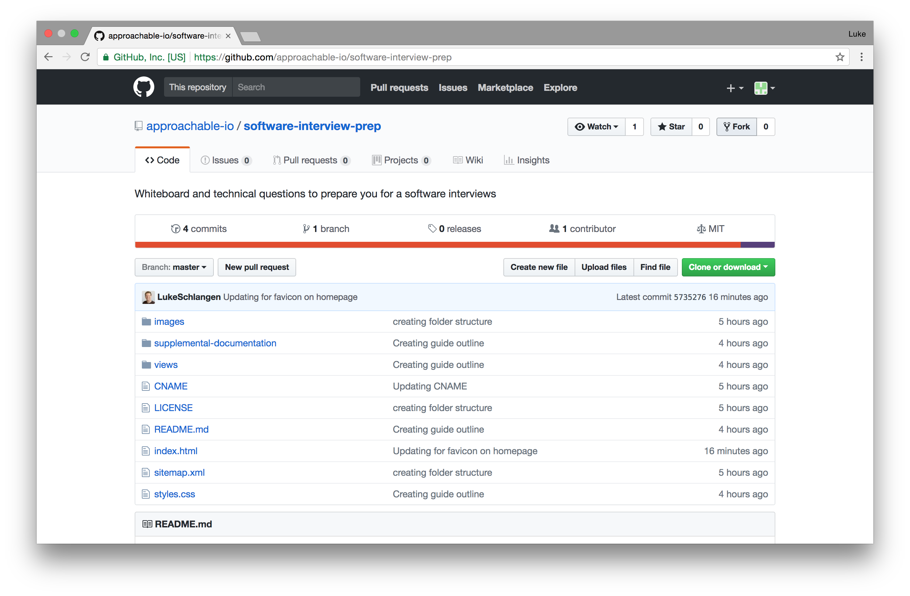

If everything goes smoothly it should look like this for a few seconds

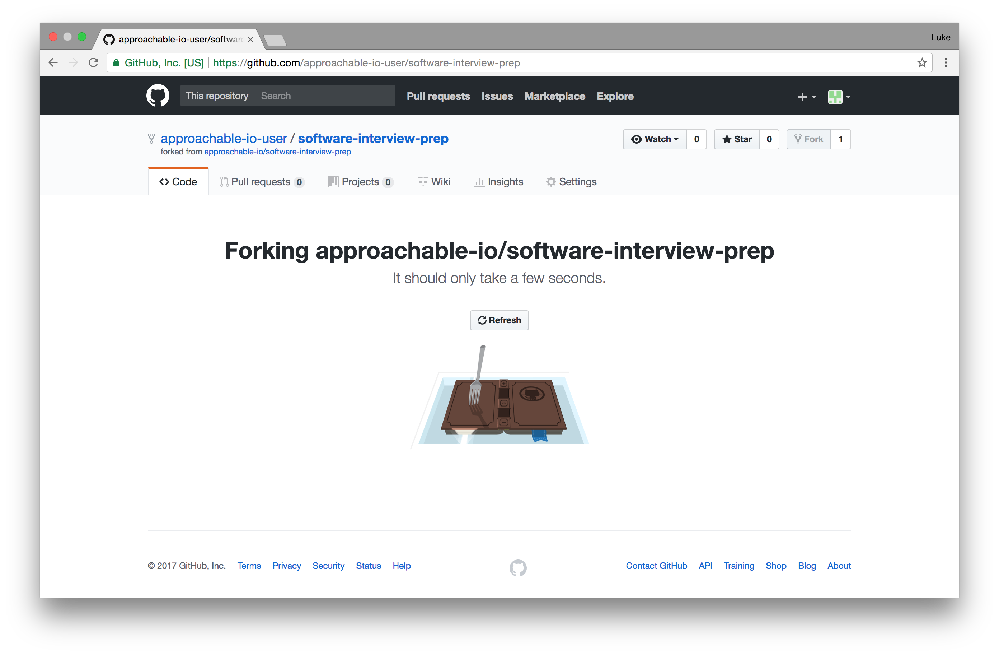

And then it should look like this 

The difference between the repository you started with and this new repository is that your username should appear in the top left. If your username is `grace-hopper`, it should say something like `grace-hopper / software-interview-prep` and the line below it should read `forked from approachable-io / software-interview-prep`.

### Clone the fork

Once you've forked the repo, you need to be able to edit it on your local machine.

To do this, click on the green clone or download button, and click the clipboard to copy the repo URL.

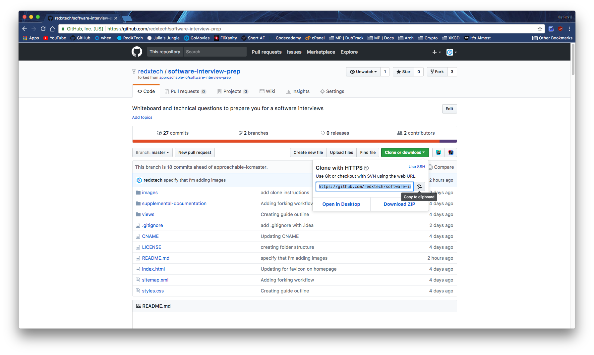

In this picture, you can see that the clone is using HTTPS format (h<span>ttps://git</span>hub.com/\<user\>/\<repo\>
.git). You may
 also  use the SSH format if you prefer (git<span>@github.c</span>om:\<user\>/\<repo\>).

Once you have that copied, open your command line (cmd.exe on Windows, Terminal on macOS, and if you use linux you'll
 know where it is), `cd` to the directory you want to clone the repo into. For me it will be `~` (`/home/redxtech/`).

Once you're in your desired directory, run this command (remember to replace the `redxtech` with your github name - 
you want to clone your fork, not mine):
```bash
git clone https://github.com/redxtech/software-interview-prep.git
```
That will be cloned into a directory called `software-interview-prep`. If I wanted to make it a different directory, I would run this 
command:
```bash
git clone https://github.com/redxtech/software-interview-prep.git ~/cloned-folder
```

Once it finishes, you can `cd` into the directory with `cd software-interview-prep`.

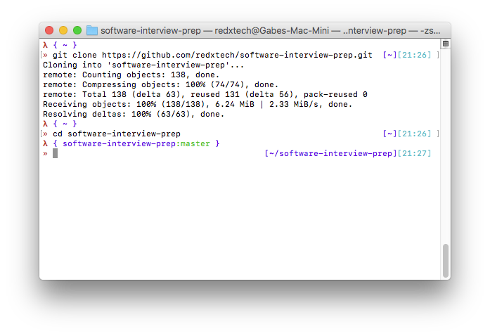

### Install dependencies

At this point, many projects will require you to install dependencies. Put simply, this is external software which is needed for the product to function correctly. 

Luckily, this repo does not require dependencies but if you would like to learn more, [click here.](supplemental-documentation/dependencies.md)

### Creating a branch

Most projects utilize git's branch feature, as they should. It's a powerful tool. I won't go into depth explaining it,
 but you can find many resources online. In a few words, they are ways to let multiple people work on separate things
 at the same time.

To create a branch for your contribution, run this command:

```bash
git checkout -b <branch name>
```

This creates a new branch in the repo, and checks it out (opens it). If there are already multiple branches, and
 you want to make a branched based off of another branch, use:
 
 ```bash
 git checkout -b <branch name> master
 ```

Where master is the name of the branch you want to base your new branch off of. To switch to another branch that has 
already been created, run:

```bash
git checkout <branch name>
```

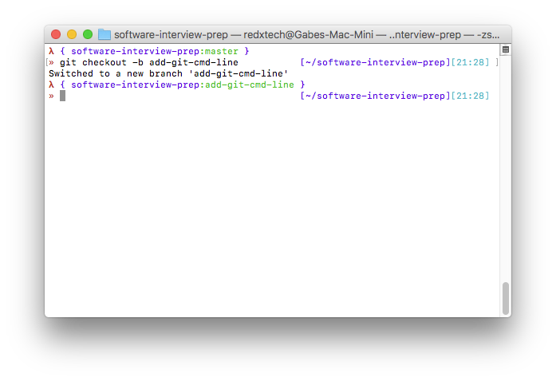

### Making your changes

Now that we have our own branch, we can begin to contribute. First, we need to make some changes. What I'm doing 
right now, is adding images to the `README.md` file, so I would open up any text editor, and open the file.

Any editor or IDE will work just fine (I personally use WebStorm for projects and sublime for one-off files), Some 
popular editors include Atom, VS Code, and even vim or nano if you have experience using either.

Once we've made all the changes necessary, we need to stage them:

```bash
git add README.md
```

You can stage all files by using `.` instead of a filename. This is useful when you have more than one file that has 
changed, like when I added the images. I'm also going to run `git add images` to stage the entire directory that I 
put the images in. You can check the status of your changes with:

```bash
git status
```

And see what changes you've made since your latest commit with:

```bash
git diff
```

To exit this screen press `q`.

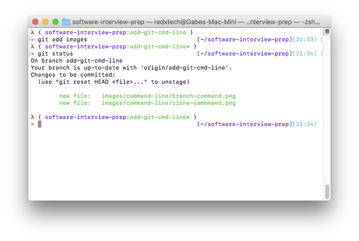

### Committing changes

Once you've staged your changes, you're ready to commit them. Committing is marking a change in your project, and you
 can reset to that commit easily. To commit your staged changes, run:

```bash
git commit -m "made changes"
```

The `-m` and `"made changes"` mean commit with message `"made changes"`. Every commit needs a message, as it 
describes what the commit did. Try to make these messages useful, as not doing so can make it harder if you need to 
backtrack, and if anyone else wants to see what you've done.

If you're lazy, and want to save as many keystrokes as possible, you can run:

```bash
git commit -ma "made changes"
```

The `a` means stage all changes. This removes the need to `git add .`, as it does this already.

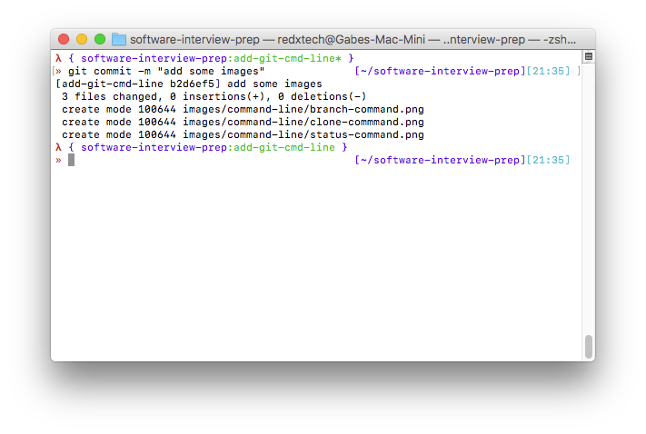

### Pushing commits

Once you've made your changes and committed them, you'll want to share your changes to the original repo (the one you
 forked). The changes you've made will stay on your local machine until you push them. Pushing is quite simple. Most 
 of the time, it's only two words to type in:

```bash
git push
```

However, sometimes you want to specify a location to push to, and a branch to push to. By default, when you clone a 
repo from github, it adds the `origin` remote location, and sets it as upstream, so just using `push` works fine. 
Sometimes, you might not want to send it the default location:

```bash
git push <remote> <branch>
```

The repo that you cloned will be set as remote `origin`, so `git push origin master` will push to the master branch
 on your fork on github. If you want to send it to your branch that you're working on (this is what I'm going to do 
 here), you will need to specify that:

```bash
git push origin <branch>
```

This way, you can have your branch on your fork as well as on your local computer.

Sometimes, you will have to enter your github credentials, to make sure that you have write access to the repo. Just 
enter your github username and password and it will work. This can be avoided using SSH & SSH Keys, however that's 
way outside the scope of this guide.

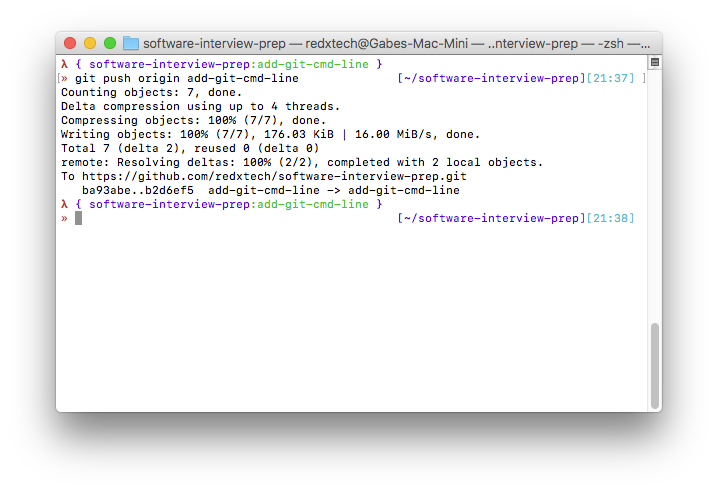

### Stash & Pop

Sometimes, you make a few changes, and you're not quite ready to commit them, but you need to store them somewhere 
safe. This is the time for stashing and popping!

If you've made changes to the `README.md` file, and you wanted to stash it away, all you have to do is:

```bash
git add .
```
and
```bash
git stash
```

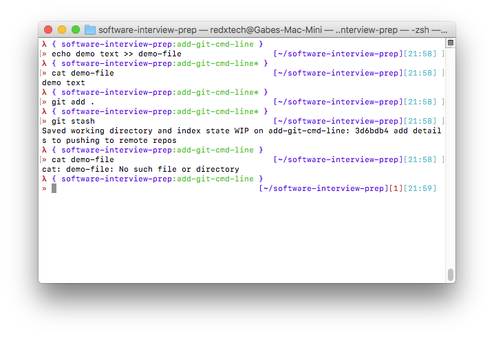

Once you've done what you need to do, you can un-stash (pop) the changes, and begin to work on them again! To do 
this, just run:

```bash
git stash pop
```

And your changes are there again.

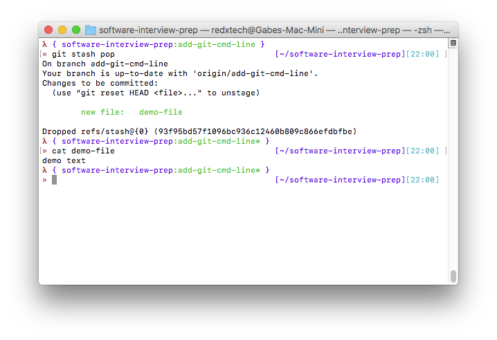

### Making a Pull Request (PR)

Once you've pushed your changes to your fork, you will need to make a PR to the repo that you forked from. Making a 
PR is quite simple. All you have to do is go to the github page of your fork, and click on the Compare & pull request
 button that will appear once you have some commits that the original repo doesn't have.

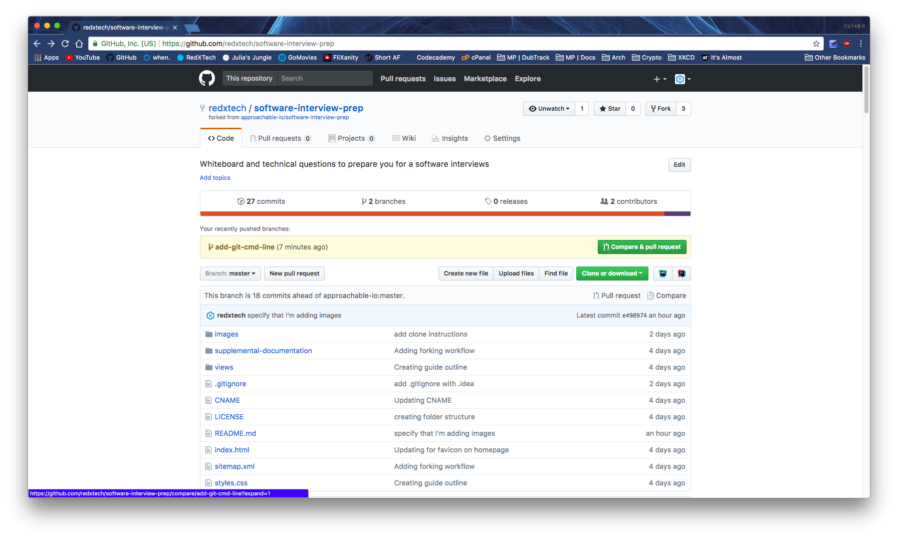

Once you click on that, it will bring you to a page where you can look at the commits, files changed, and choose what
 to add some details to your PR. Choose an appropriate title for your PR, and also a description.

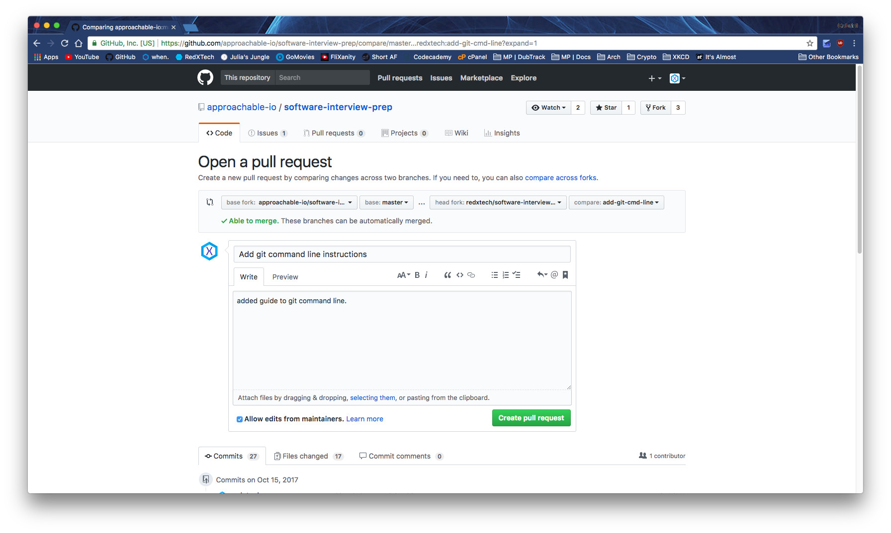

If there is a green check mark at the top saying "Able to merge", then the PR is perfect (in terms of merge 
conflicts). You don't need to do anything else special to make it work. If there is a red x, and you are unable to 
merge, no worries, this can easily be remedied. This happens when someone else makes edits to the same part of a file
 as you while your were working on yours. You can either resolve the conflicts by yourself (recommended), or get 
 someone else (more experience with the specific codebase) to resolve the conflicts for you. Most people expect you 
 to be able to solve your own, however if you're contributing to a beginner friendly repo, most people would be happy
 to walk you through resolving the conflicts so that you learn how to do in the proper manner according to their 
 codebase.

Make sure that the dropdown menus near the top of the page are correct. "base fork" is the repo that you want to make
 a PR into. "base" is the branch you want to PR into on that repo. "head fork" is your fork of the repo. "compare" is
 that branch that you pushed your changes into.

Once everything looks all good to go, click on "Create pull request", and boom, it's done. Now you just need to wait 
for someone to review it. In most projects, each PR needs to be approved by at least one person before it can be 
merged. They can either reject it, requests changes, or approve it. If they request some changes, adding those 
changes is as simple as pushing to the same branch on your fork again. Once your PR is deemed worthy, one of the 
maintainers will merge it, and congrats, your PR has been added to the codebase!

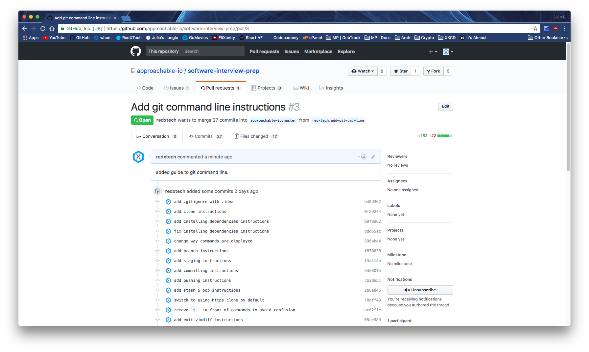

## Want to contribute in another way?
Anyone can help make this project better - check out [issues](https://github.com/approachable-io/approachable-io/issues)!
